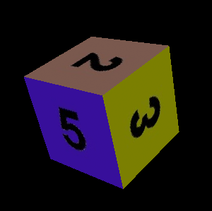

# Lesson 3 - texture and Interaction

## Outline
* Texture
* Combining texture and Illumination
* Keyboard Interaction

# Using a texture in a plane
Modify the rotating cube example ( https://threejs.org/docs/index.html#manual/introduction/Creating-a-scene) to show a plane (PlaneGeometry).
Use the Material's map attribute to apply the Lena.jpg image as the plane texture. To read the image, you can use the following code:
``` html
var texloader = new THREE.TextureLoader();
var tex=texloader.load("../images/lena.jpg");
```
Remember that most browser limit access to local files so you need to use a local server or enabling the browser to access local files. 
You might use a server in python: python -m SimpleHTTPServer 8000 and then access the address http://localhost:8000, or an extension on your editor (Live extension of VS Code for example)

Modify the size of the plane, what happens to the texture?

#	Texture on a cube
Use the lena.jpg image as the texture for the cube. How is the image mapped to the cube.
Modify the program to map a different image to each face of the cube (use the images Im1.jpg, Im2.jpg... Im6.jpg). To use several texture, you need to aggregate all the textures in a materials variable (var materials = [])  using the push command. Modify the example to use multiple textures  obtaining the result of the following figure.
``` html
const materials = [];
materials.push(new THREE.MeshBasicMaterial({ map: new THREE.TextureLoader().load('Image.jpg') }));

const cube = new THREE.Mesh(geometry, materials);
``` 
Use OrbitControls to control the position and orientation of the cube (see lesson 2).

 


# texture and Lighting
Create a program to visualize a sphere of radius 1 (use 32 segments in width and height). Apply the planisphere texture (earth_surface_2048.jpg) to the sphere. View the model with a fixed rotation on the Z axis (use 0.41 rad) and with an animation (a rotation around the y axis of 0.0025 rad).
Now add lighting to the scene. Use a MeshPhongMaterial type material with the texture (instead of a MeshBasicMaterial). Add an ambient light with the value 0x333333 and a directional light with direction (1,0,0) and with the value 0xfffff representing the sun.

# Interaction
Add the following code to respond to the keydown event.
``` html
document.addEventListener("keydown", onDocumentKeyDown, false);
``` 
Use the following function to see which key was pressed on the console:
``` html
function onDocumentKeyDown(event){ 
// Get the key code of the pressed key 
var keyCode = event.which;
console.log("tecla " + keyCode);
}
``` 

# Lighting activation
Modify the code to allow turning on/off the directional light via the L key (this can be done by removing the light from the scene, or changing the material to a MeshBasicMaterial, see the difference between these two methods).

Add the possibility to increase/decrease the light intensity using the + and - keys. Use the function of the previous section to find out the ASCII-code of the keys to use.

#	Modify position and rotation
Use the arrow keys [left and right] to increase/decrease the rotation speed around the yy axis axes and the Up/Down keys to increase/decrease the inclination of the model around the zz axis.

# Concatenation of transformations / addition of the moon
Add a new model to represent the moon using the texture moon_1024.jpg. Consider the following constants:
``` html
DISTANCE_FROM_EARTH = 356400;
PERIOD = 28;
INCLINATION = 0.089;
SIZE_IN_EARTHS = 1 / 3.7;
EARTH_RADIUS = 6371;
``` 
To allow the moon to rotate around the earth, note that you have to create the moon as a child of the earth to be influenced by the earth's transformations (transformations applied to earth are automatically applied to the moon, multiplying the transformation matrices of the two objects) . For this, the moon model must be added (add) to the earth model. Consider the following transformations to initialize the moon in the correct position and apply the correct animation:

``` html
var distance = DISTANCE_FROM_EARTH / EARTH_RADIUS;
moon.position.set(Math.sqrt(distance / 2), 0,-Math.sqrt(distance / 2));

// Rotate the moon so it shows its moon-face toward earth
moon.rotation.y = Math.PI;
moon.rotation.x = INCLINATION;

// For animation 
moon.rotation.y += (earth.rotation.y / PERIOD);
``` 
